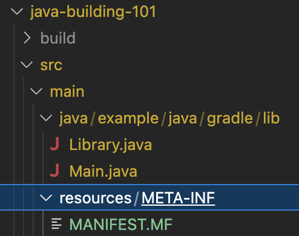
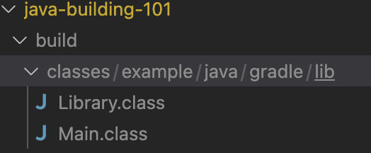
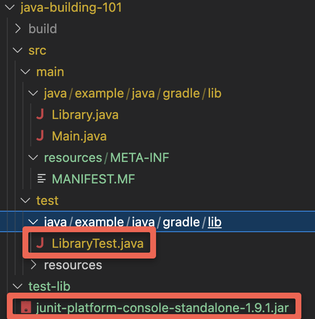
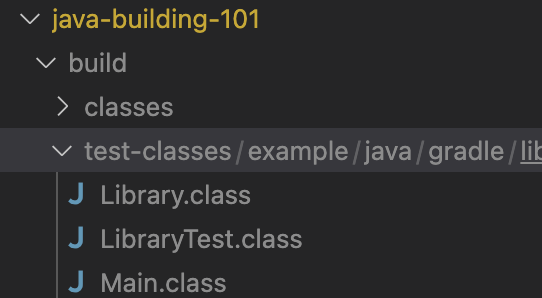

# Building Java 101

The purpose of this example is to show how to build a java application, without the use of any of the command available build tooling. Specifcally, no Ant, no Gradle, and no Maven. Why? Because armed with this information you now know how all of the internals for building Java on any technology stack. Specifically:

1. Turning .java files into .class files
2. Putting .class files into a .jar file (that is also executable)
3. Running that .jar file
4. How to include unit testing

All of those fancy build tools are doing this stuff behind the scenes for you, so understanding these basics is critical for being able to troubelshoot when things don't work. 

# (1) Install Java (JDK)

## JDK versus JRE versus JVM

1. JDK is for development purpose whereas JRE is for running the java programs.
2. JDK and JRE both contains JVM so that we can run our java program.
3. JVM is the heart of java programming language and provides platform independence.

Reference: https://www.digitalocean.com/community/tutorials/difference-jdk-vs-jre-vs-jvm

## OpenJDK?

There used to be a single entity for JDK known as Oracle JDK, however in the recent past they decided that they were going to now change money for using it, thus OpenJDK was born and it is what nearly everyone uses now. OpenJDK is the free version of the JDK.

## Installing

### Windows

Per https://learn.microsoft.com/en-us/java/openjdk/download, the most simple way to install the JDK is via the MSI: https://aka.ms/download-jdk/microsoft-jdk-17.0.5-windows-x64.msi

Installing it this way will put in on your PATH, giving you access to the `javac`, `java`, and `jar` commands.

#### Linux

Download the architecture appropriate zip from https://jdk.java.net/, extract it, and add its bin directory to the PATH environment variable.

#### Mac

It is highly recommended you use Homebrew, which then only requires you to run a single command, where you then have to add it to PATH and reload your shell:

```bash
brew install openjdk 
echo 'export PATH="/opt/homebrew/opt/openjdk/bin:$PATH"' >> ~/.zshrc
source ~/.zshrc
```

## How do I know it worked?

```bash
$ java -version
openjdk version "19.0.1" 2022-10-18
OpenJDK Runtime Environment Homebrew (build 19.0.1)
OpenJDK 64-Bit Server VM Homebrew (build 19.0.1, mixed mode, sharing)
```

If you see OpenJDK in the output, you have all the tools available at the command-line.

# (2) Building Java

Consider the following project structure:



**Library.java** - Just a class this one method that returns true.

```java
package example.java.gradle.lib;

public class Library {
    public boolean someLibraryMethod() {
        return true;
    }
}
```

**Main.java** - The main class as denoted by `public static void main(String[] args)`, which just calls the result of the one Library method to the console, which is always `true`.

```java
package example.java.gradle.lib;

public class Main {
    
    public static void main(String[] args) {
        Library library = new Library();
        System.out.println(library.someLibraryMethod() + "");
    }

}
```

**MANIFEST.MF** - How we tell java what class is the entry point to the application

```properties
Manifest-Version: 1.0
Main-Class: example.java.gradle.lib.Main

```


## Turning .java files into .class files

We call this compiling even though technically the result is bytecode, but whatever. This is taking the source code and converting in into a binary format (assuming build/classes is an empty directory):

```bash
$ javac -d build/classes \
    src/main/java/example/java/gradle/lib/Library.java \
    src/main/java/example/java/gradle/lib/Main.java
```

What we are doing here is creating the compile classpath at build/classes:



That is a fancy way of saying we have the binary representation of our two classes that will be backed into our .jar.

## Making an executable jar

A jar by itself is just a colleciton of classes, with can be accessed like a library with any other thing that puts this jar on its class path. We we building an executable jar here as a means to easily verity it worked. Specifcally, we can execute it to let us know what we did was corrrect.

This command takes those class files we created, put them in a JAR, but also includes the manifest file which tells us the entry point into the application:

```bash
$ jar -cvfm build/main.jar \
    src/main/resources/META-INF/MANIFEST.MF \
    -C build/classes .

added manifest
adding: example/(in = 0) (out= 0)(stored 0%)
adding: example/java/(in = 0) (out= 0)(stored 0%)
adding: example/java/gradle/(in = 0) (out= 0)(stored 0%)
adding: example/java/gradle/lib/(in = 0) (out= 0)(stored 0%)
adding: example/java/gradle/lib/Library.class(in = 278) (out= 212)(deflated 23%)
adding: example/java/gradle/lib/Main.class(in = 947) (out= 525)(deflated 44%)
```

## Running the application

You then this command, and if it worked the output is "true":

```bash
$ java -jar build/main.jar  

true
```

# (3) Testing Java

JUnit is the common means for unit testing Java, so I am going to demonstrate how to use it using purely the command-line as well. Seeing how complicated this can get will help you understand why frameworks like Maven and Gradle were built around making this easier.

Consider the following change to the directory structure:



**LibraryTest.java** - This is a unit test that asserts our Library class' someLibraryMethod returns true.

```java
package example.java.gradle.lib;

import org.junit.jupiter.api.Test;
import static org.junit.jupiter.api.Assertions.*;

class LibraryTest {
    @Test void someLibraryMethodReturnsTrue() {
        Library classUnderTest = new Library();
        assertTrue(classUnderTest.someLibraryMethod(), "someLibraryMethod should return 'true'");
    }
}
```

It makes use of a third party library, so we have to now include that library in order to compile.

## Creating the test compile path

We don't don't want to compile our testing work into a main classpath, which is what we have on build/classes. This is because if we do this we will be distributed our test classes in our Jar file. To accomplish this, we are going to use build/test-classes. However, because our test classes depend on our main classes, we need to compile them as well. Additionally, we are dependent on third-party classes that come from a different jar file, so that also has to be included in our classpath:

```bash
$ javac -d build/test-classes \
    -cp test-lib/junit-platform-console-standalone-1.9.1.jar \
    src/main/java/example/java/gradle/lib/Library.java \
    src/main/java/example/java/gradle/lib/Main.java \
    src/test/java/example/java/gradle/lib/LibraryTest.java 
```

The end result is that these classes are now present under build/test-classes:



## Executing the tests

That junit jar that we are using as a dependency, also acts as its own application. This is important because we are going to use it to execute our unit tests:

```bash
$ java -jar \
    test-lib/junit-platform-console-standalone-1.9.1.jar  \
    --class-path build/test-classes \
    --select-package example.java.gradle.lib
    
Thanks for using JUnit! Support its development at https://junit.org/sponsoring

╷
├─ JUnit Jupiter ✔
│  └─ LibraryTest ✔
│     └─ someLibraryMethodReturnsTrue() ✔
├─ JUnit Vintage ✔
└─ JUnit Platform Suite ✔

Test run finished after 43 ms
[         4 containers found      ]
[         0 containers skipped    ]
[         4 containers started    ]
[         0 containers aborted    ]
[         4 containers successful ]
[         0 containers failed     ]
[         1 tests found           ]
[         0 tests skipped         ]
[         1 tests started         ]
[         0 tests aborted         ]
[         1 tests successful      ]
[         0 tests failed          ]
```

What we did here is tell is to execute all th tests in the package of `example.java.gradle.lib` using the classes found under `build/test-classes`.